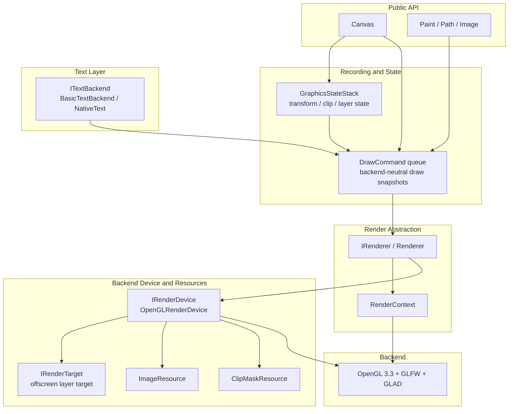

# PrismCanvas

PrismCanvas is a small C++17 canvas playground that builds a Skia-like 2D drawing surface on top of OpenGL. The current demo focuses on path tessellation, strokes, gradients, clipping, transforms, image sampling, text primitives, readback, and simple regression hooks. The architecture is intentionally renderer-facing, so Metal and Vulkan backends can be added without changing the Canvas-facing API shape.

## Highlights

- Immediate-mode `Canvas` API for points, lines, paths, rectangles, rounded rectangles, circles, ovals, arcs, images, and text.
- `Paint` state for stroke/fill styles, alpha, gradients, blend modes, image sampling, tile modes, dash effects, corner effects, and text alignment.
- Save/restore, transforms, clipping, saveLayer-style offscreen composition, hit testing, pixel readback, PPM capture, and FNV-1a pixel hashes.
- OpenGL 3.3 backend with GLFW windowing, GLAD loading, GLM math, STB image/text helpers, and Polyline2D stroke meshes.
- Text now routes through a small backend boundary: the default `BasicTextBackend` composes shared ASCII fallback helpers and a Windows native text adapter, instead of keeping all text logic inside `Canvas.cpp`.
- Third-party source projects are pulled with Git submodules.

## Current Feature Set

- 2D primitive drawing for points, lines, polylines, polygons, rectangles, rounded rectangles, circles, ovals, arcs, and arbitrary filled or stroked paths.
- Rich `Paint` controls including solid fills, stroke styles, alpha, Porter-Duff style blend modes, linear/radial gradients, image sampling, tile modes, dash effects, corner rounding effects, and text layout knobs.
- Full state stack support with save/restore, transform concatenation, rectangular clip, non-rect `clipPath`, and `saveLayer` offscreen composition.
- Image workflows for raw RGBA uploads, file-backed `Image` loading, drawImage variants, fit/cover/contain placement, nine-patch rendering, and tiled image drawing.
- Text workflows for plain text, wrapped text boxes, path text, measurement APIs, and a pluggable text backend that already separates fallback text utilities from the Windows native adapter.
- Diagnostics and validation hooks including framebuffer readback, PPM capture, deterministic pixel hashing, smoke scripts, `ctest` integration, and lightweight unit coverage for state stack and header-only path behavior.
- Reusable library-first packaging through `PrismCanvasOpenGL`, with independent example apps for Tetris, Racer, and Bubble Shooter sharing the same engine target.

## Why This Design Works Well

- Stable Canvas-facing API: drawing code talks to `Canvas`, `Paint`, `Path`, and `Image` instead of backend-specific OpenGL handles.
- Clear rendering boundaries: recording, resource ownership, backend device logic, and offscreen targets are split across `IRenderer`, `IRenderDevice`, `IRenderTarget`, `ImageResource`, and `ClipMaskResource`.
- Safer resource lifetime: generic draw data no longer owns raw texture IDs or clip triangulation payloads directly, which reduces cross-layer cleanup bugs.
- Better backend portability: the current implementation is OpenGL-only, but the API and resource seams are already shaped so Metal or Vulkan backends can slot in below the same Canvas surface.
- Testable behavior: smoke gates cover rendered output, examples verify shared-engine reuse, and unit tests now cover stack semantics plus core `Path` math behaviors without needing an OpenGL window.

## Architecture

The current engine is organized as a layered pipeline: `Canvas` records backend-neutral draw intent, the renderer coordinates command submission, the device owns backend resources, and offscreen/lifetime-sensitive work is delegated to dedicated resource objects instead of leaking OpenGL details upward.



See [doc/architecture/README.md](doc/architecture/README.md) and the ADRs under [doc/architecture](doc/architecture) for the longer-form design rationale.

## Canvas API

The current public `Canvas` surface is intentionally close to familiar 2D canvas APIs. The list below is a compact map of the available entry points and what each one is for.

```cpp
class Canvas {
	struct TextMetrics;                         // Stores measured text width, height, bounds, ascent, and descent.
	enum class ImageFit { FILL, CONTAIN, COVER }; // Controls how an image fits into a destination rectangle.
	enum class ImageAnchor { ... };             // Controls the anchor point used by fitted images.

	static void initialize();                   // Initializes shared canvas rendering resources.
	static void finalize();                     // Releases shared canvas rendering resources.

	void shutdown();                            // Explicitly tears down the current renderer instance.
	void setSize(int width, int height);        // Sets the drawing surface size.
	int getWidth() const;                       // Returns the current surface width.
	int getHeight() const;                      // Returns the current surface height.
	void setColor(Color color);                 // Sets the default canvas color state.

	void drawColor(const Color& color);         // Clears/fills the whole canvas with a solid color.
	void drawPaint(const Paint& paint);         // Fills the whole canvas using Paint state.
	void drawPoint(...);                        // Draws one point, with int/float/Point/PointF overloads.
	void drawPoints(...);                       // Draws multiple points.
	void drawLine(...);                         // Draws one line segment.
	void drawLines(...);                        // Draws independent line segments from point arrays.
	void drawPolyline(...);                     // Draws a connected open polyline.
	void drawPolygon(...);                      // Draws a connected closed polygon.
	void drawRect(...);                         // Draws an axis-aligned rectangle.
	void drawRoundRect(...);                    // Draws rounded rectangles, including independent corner radii.
	void drawCircle(...);                       // Draws a circle.
	void drawOval(...);                         // Draws an oval inside a bounding rectangle.
	void drawArc(...);                          // Draws an arc, optionally connected to the center.
	void drawPath(const Path& path, ...);       // Draws arbitrary paths with fill/stroke Paint state.
	RectF measureStrokeBounds(...);             // Measures the stroke bounds of a path.

	void drawImage(...);                        // Draws an image at a point, into a dst rect, or from src to dst.
	void drawImageFit(...);                     // Draws an image with fill/contain/cover fitting.
	void drawImageNinePatch(...);               // Draws a nine-patch image region into a destination rect.
	void drawImageTiled(...);                   // Draws a repeated/tiled image region.

	void drawText(...);                         // Draws a single text run.
	void drawTextBox(...);                      // Draws wrapped text inside clipped bounds, with optional max lines.
	void drawTextOnPath(...);                   // Places text along a path.
	float measureText(...);                     // Measures text width.
	RectF measureTextBounds(...);               // Measures text bounds.
	TextMetrics measureTextMetrics(...);        // Measures text metrics and bounds in one call.

	int save();                                 // Saves matrix and clip state.
	int saveLayer(...);                         // Saves a composited offscreen layer.
	void restore();                             // Restores the latest saved state or layer.
	int getSaveCount() const;                   // Returns the current save stack depth.
	void restoreToCount(int saveCount);         // Restores back to a previous save count.

	const glm::mat4& getMatrix() const;         // Returns the current transform matrix.
	PointF mapPoint(...);                       // Maps a local point through the current matrix.
	RectF mapRect(...);                         // Maps a rect through the current matrix.
	bool inverseMapPoint(...);                  // Converts a device-space point back to local space.
	bool inverseMapRect(...);                   // Converts a device-space rect back to local space.
	void setMatrix(const glm::mat4& matrix);    // Replaces the current transform matrix.
	void resetMatrix();                         // Resets the transform to identity.
	void concat(const glm::mat4& matrix);       // Concatenates another transform.
	void translate(float dx, float dy);         // Applies translation.
	void scale(float sx, float sy);             // Applies scale.
	void rotate(float radians);                 // Applies rotation in radians.

	void clipRect(...);                         // Intersects the current clip with a rectangle.
	void clipPath(const Path& path);            // Intersects the current clip with a filled path.
	bool hasClip() const;                       // Reports whether a clip is active.
	bool getClipBounds(RectF& bounds) const;    // Returns the current clip bounds.
	bool isPointInClip(...);                    // Tests whether a device-space point is inside the clip.
	bool quickReject(...);                      // Quickly rejects rect/path draws outside canvas or clip bounds.
	bool hitTestPathFill(...);                  // Hit-tests path fill in device space.
	bool hitTestPathStroke(...);                // Hit-tests path stroke in device space.

	void beginFrame();                          // Starts a frame and prepares command collection.
	void flush();                               // Flushes queued draw commands.
	void endFrame();                            // Flushes and completes the current frame.
	bool readPixelsRGBA(...);                   // Reads the framebuffer as top-left-origin RGBA pixels.
	std::vector<unsigned char> readPixelsRGBA() const; // Convenience pixel readback overload.
	bool savePixelsPPM(const std::string& path) const; // Saves a simple RGB PPM screenshot.
	static std::uint64_t hashPixelsRGBA(...);   // Hashes RGBA pixels with FNV-1a 64-bit.
	std::uint64_t computePixelsHashRGBA() const;// Reads and hashes the current framebuffer.
};
```

## Example

Examples live under `example/` and are meant to show how the Canvas API can be used beyond isolated drawing primitives. The current repository includes gameplay-focused demos such as Tetris, Racer, and Bubble Shooter, and more game/UI samples will continue to be added here as the project grows.

### Tetris

The Tetris example is under [example/game/tetris](example/game/tetris). It uses PrismCanvas to draw the game board, falling blocks, text, preview/score panels, and simple game UI elements.


### Racer

The Racer example is under [example/game/racer](example/game/racer). It uses PrismCanvas to render a vertically scrolling road, clipped traffic/fuel pickups, a side speed meter, and an arcade HUD. Traffic spawning now enforces larger vertical spacing between lanes and keeps a final escape lane around the player to avoid unavoidable collisions.


### Bubble Shooter

The Bubble Shooter example is under [example/game/bubble_shooter](example/game/bubble_shooter). It uses PrismCanvas to render a hex-grid bubble field, the aiming guide, the launcher, and a compact HUD panel for score, level, next bubble, controls, and performance stats.


Run it from the example directory:


## Requirements

- CMake 3.16 or newer.
- A C++17 compiler.
- Windows: Visual Studio 2022 with the Desktop C++ workload.
- macOS/Linux: OpenGL development libraries and a toolchain supported by GLFW.

## Clone

```bash
git clone --recurse-submodules https://github.com/ClarkWain/PrismCanvas
cd PrismCanvas
```

If the repository was cloned without submodules:

```bash
git submodule update --init --recursive
```

## Build

Windows:

```bat
build.bat --no-run
build.bat --release --no-run
build.bat
```

macOS/Linux:

```bash
chmod +x build.sh
./build.sh --no-run
./build.sh
```

The demo target is `PrismCanvasDemo`.

The reusable OpenGL-backed engine code is now built as the `PrismCanvasOpenGL` library target, and the demo executable links that target instead of compiling the engine sources directly.

Shared draw/image data now uses backend-neutral image-resource objects instead of passing naked texture IDs or manual release callbacks through the cross-module canvas command model.

`Renderer` is now primarily a command-queue/coordination layer; backend lifecycle, image resource creation, offscreen image rendering, and pixel readback route through a dedicated `IRenderDevice` boundary with the current `OpenGLRenderDevice` implementation underneath. Offscreen layer rendering also now flows through backend-owned render-target objects instead of one monolithic FBO procedure.

OpenGL texture lifecycle helpers are now centralized in `src/opengl/GLTextureUtils.cpp`, and command-time blend/scissor state application is routed through `RenderContext` instead of ad-hoc helpers in generic command types.

Image texture sampling/wrap state is also applied through `RenderContext`, and the default `BasicTextBackend` keeps a bounded native-text cache instead of growing without limit.

The current OpenGL backend also has a first `clipPath` slice: rectangular path clips degenerate to scissor when possible, non-rect path clips precompute a mask during recording, repeated identical clip snapshots can reuse stencil state across adjacent commands, stacked path clips accumulate through stencil counting, and offscreen layer render targets allocate a stencil attachment so path clips survive `saveLayer` composition.

Non-rect clip masks now also flow through shared backend-owned clip resource objects before `RenderContext` rebuilds stencil state, so generic draw data no longer needs to carry raw clip triangulation arrays all the way to command execution.

`Image` is now a move-only opaque resource owner, and image file uploads route through the active renderer/device path instead of having `Image.cpp` call OpenGL texture helpers or a process-global upload factory directly. The shared draw/render model now treats image resources as shared `ImageResource` interfaces backed by backend-private implementations, so generic draw code no longer reaches into raw image handles.

## Third-Party Dependencies

Submodules:

- GLFW: window and OpenGL context creation.
- GLM: matrix and vector math.
- STB: image loading and lightweight demo text generation.
- Polyline2D: stroke mesh generation.

Generated source kept in-tree:

- GLAD: generated OpenGL 3.3 core loader files under `third_party/glad`.

## Debug Hooks

The demo supports a few environment variables for quick rendering checks:

```bash
CPPDEMO_CAPTURE_PPM=build/capture.ppm ./build/PrismCanvasDemo
CPPDEMO_PRINT_PIXEL_HASH=1 ./build/PrismCanvasDemo
CPPDEMO_EXPECT_PIXEL_HASH=<uint64> ./build/PrismCanvasDemo
CPPDEMO_EXIT_AFTER_FIRST_FRAME=1 ./build/PrismCanvasDemo
CPPDEMO_FIXED_TIME_SECONDS=1.25 ./build/PrismCanvasDemo
CPPDEMO_DISABLE_MSAA=1 ./build/PrismCanvasDemo
CPPDEMO_EXERCISE_CLIP_PATH=1 ./build/PrismCanvasDemo
```

The Racer example also recognizes `CPPDEMO_CAPTURE_PPM`, `CPPDEMO_EXIT_AFTER_FIRST_FRAME`, `CPPDEMO_FIXED_TIME_SECONDS`, and `CPPDEMO_DISABLE_MSAA`, so one-frame captures can be scripted into `images/` when updating docs.

When shutting down a real window/context, prefer `canvas.shutdown()` before tearing down the graphics context so backend resources are released while the context is still current.

Pixel hashes are exact and can vary by GPU, driver, MSAA behavior, and platform. Treat them as a fast local regression aid rather than a portable golden image format.

`CPPDEMO_EXERCISE_CLIP_PATH=1` switches one demo clip sample from an axis-aligned rectangle to stacked ovals so the non-rect multi-`clipPath` stencil path can be smoke-tested without changing the default regression image.

Use `smoke_test.bat` on Windows or `sh smoke_test.sh` on macOS/Linux to build the Debug target, run one fixed-time non-MSAA frame with pixel readback/hash enabled, and check the log for rendering failure markers. Pass a local expected hash as the first argument to make it strict.

Use `clip_path_smoke.bat` on Windows or `sh clip_path_smoke.sh` on macOS/Linux to run the same fixed-time smoke gate with `CPPDEMO_EXERCISE_CLIP_PATH=1`, so the demo switches one clip sample to stacked non-rect path clips and validates the stencil-backed `clipPath` intersection path explicitly.

Use `regression_smoke.bat` on Windows or `sh regression_smoke.sh` on macOS/Linux to run both strict local pixel-hash gates back-to-back. The first optional argument overrides the default smoke hash, and the second overrides the stacked `clipPath` smoke hash.

On the current Windows/NVIDIA development machine, the latest local fixed-time hashes are `2458027664413625913` for the default smoke scene and `12248791335057056593` for `clip_path_smoke`.

Use `examples_smoke.bat` on Windows or `sh examples_smoke.sh` on macOS/Linux to verify that the shared engine changes still build the independently configured Tetris, Racer, and Bubble Shooter example projects.

The root CMake project now also registers the existing script gates with `ctest` when `PRISMCANVAS_ENABLE_SCRIPT_TESTS=ON` (the default). On the current Windows setup this gives you `PrismCanvasSmoke`, `PrismCanvasClipPathSmoke`, and `PrismCanvasExamplesSmoke`; enable `PRISMCANVAS_ENABLE_LOCAL_REGRESSION_TEST=ON` if you also want the strict local pixel-hash regression gate registered through `ctest`.

The current lightweight unit executable is `PrismCanvasGraphicsStateStackTests`. It exercises `GraphicsStateStack` save/restore behavior plus header-only `Path` semantics such as even-odd containment, stroke hit-testing, trim, and reverse. Because `build.bat` still builds the demo target by default, this unit executable is built on demand through the `ctest` wrapper before it runs.

Typical local test entry points:

```bat
ctest -C Debug -N
ctest -C Debug -R ^PrismCanvasGraphicsStateStackTests$ --output-on-failure
ctest -C Debug -L smoke --output-on-failure
ctest -C Debug -R ^PrismCanvasSmoke$ --output-on-failure
```

On Windows, `build.bat` now emits stable machine-readable metrics such as `BUILD_CONFIGURE_MS`, `BUILD_COMPILE_MS`, `BUILD_TOTAL_MS`, and `BUILD_RESULT`. `smoke_test.bat` emits `SMOKE_BUILD_MS`, `SMOKE_RUN_MS`, `SMOKE_TOTAL_MS`, and `SMOKE_RESULT` in addition to the existing pixel-hash log output.

`examples_smoke.bat` emits `EXAMPLES_SMOKE_*` timings and result keys for each example build plus the aggregated total.

## Roadmap

- Document the engine architecture and ADRs under [doc/architecture](doc/architecture/README.md).
- Extract the Canvas core into a reusable library target.
- Add backend abstraction points for Metal and Vulkan.
- Replace the current lightweight text path with real font metrics, shaping, and glyph atlas rendering.
- Add automated render tests and a small UI layer on top of Canvas.