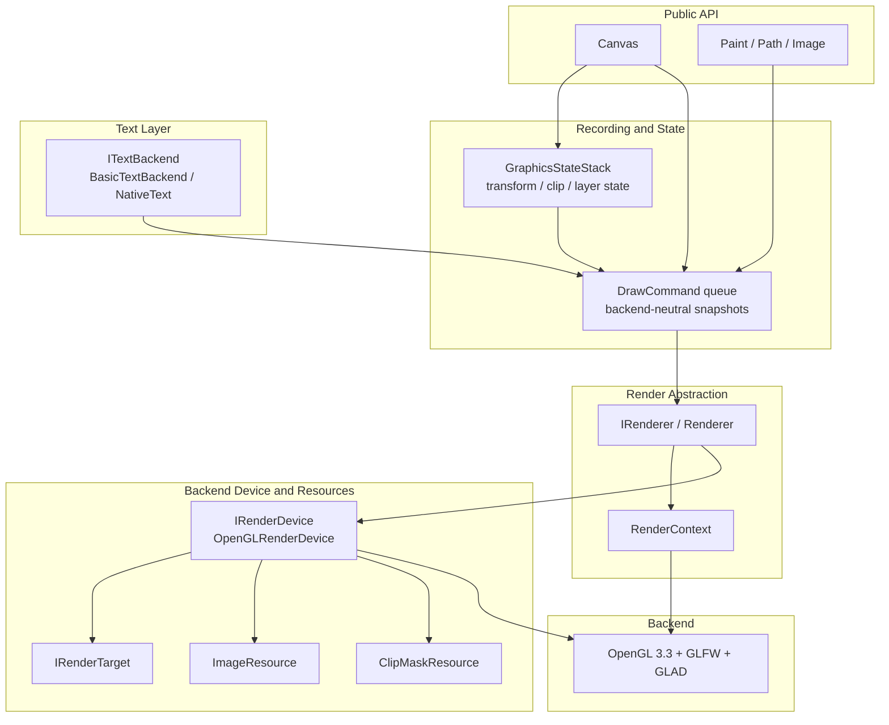
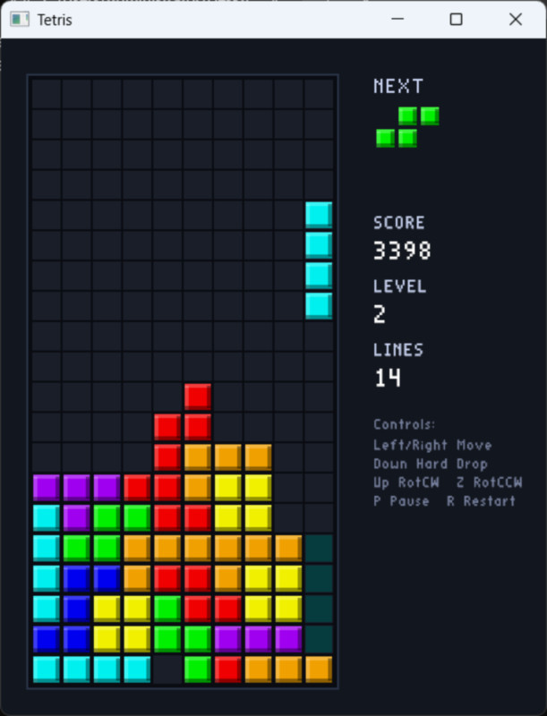
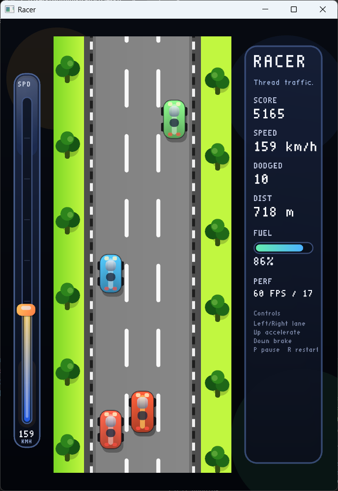
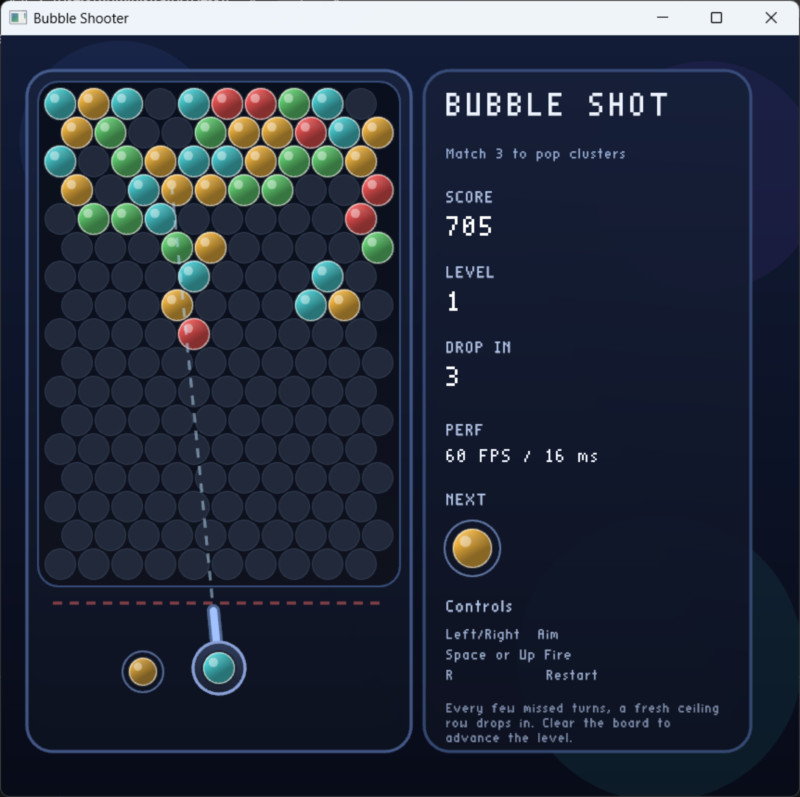

# PrismCanvas

PrismCanvas is a small C++17 canvas playground that builds a Skia-like 2D drawing surface on top of OpenGL. The repository is organized around a single `Canvas` surface, a `Paint` state object, and a renderer-facing backend split so the API stays stable as the implementation evolves.

## What It Can Do

- Draw points, lines, polylines, polygons, rectangles, rounded rectangles, circles, ovals, arcs, and arbitrary paths.
- Style fills and strokes with alpha, gradients, blend modes, dash effects, corner effects, image sampling, tile modes, and text layout controls.
- Manage save/restore, transforms, rectangular clip, `clipPath`, `saveLayer`, hit testing, image fit/fill/cover placement, nine-patch rendering, and tiled images.
- Render text through a backend boundary with `drawText`, `drawTextBox`, `drawTextOnPath`, and measurement APIs.
- Capture pixels with framebuffer readback, PPM export, and FNV-1a hashing for local regression checks.

## Canvas Surface

The public `Canvas` API is intentionally close to a familiar 2D canvas model.

```cpp
class Canvas {
    struct TextMetrics;
    enum class ImageFit { FILL, CONTAIN, COVER };
    enum class ImageAnchor { ... };

    static void initialize();
    static void finalize();

    void shutdown();
    void setSize(int width, int height);
    int getWidth() const;
    int getHeight() const;
    void setColor(Color color);

    void drawColor(const Color& color);
    void drawPaint(const Paint& paint);
    void drawPoint(...);
    void drawPoints(...);
    void drawLine(...);
    void drawLines(...);
    void drawPolyline(...);
    void drawPolygon(...);
    void drawRect(...);
    void drawRoundRect(...);
    void drawCircle(...);
    void drawOval(...);
    void drawArc(...);
    void drawPath(const Path& path, ...);
    RectF measureStrokeBounds(...);

    void drawImage(...);
    void drawImageFit(...);
    void drawImageNinePatch(...);
    void drawImageTiled(...);

    void drawText(...);
    void drawTextBox(...);
    void drawTextOnPath(...);
    float measureText(...);
    RectF measureTextBounds(...);
    TextMetrics measureTextMetrics(...);

    int save();
    int saveLayer(...);
    void restore();
    int getSaveCount() const;
    void restoreToCount(int saveCount);

    const glm::mat4& getMatrix() const;
    PointF mapPoint(...);
    RectF mapRect(...);
    bool inverseMapPoint(...);
    bool inverseMapRect(...);
    void setMatrix(const glm::mat4& matrix);
    void resetMatrix();
    void concat(const glm::mat4& matrix);
    void translate(float dx, float dy);
    void scale(float sx, float sy);
    void rotate(float radians);

    void clipRect(...);
    void clipPath(const Path& path);
    bool hasClip() const;
    bool getClipBounds(RectF& bounds) const;
    bool isPointInClip(...);
    bool quickReject(...);
    bool hitTestPathFill(...);
    bool hitTestPathStroke(...);

    void beginFrame();
    void flush();
    void endFrame();
    bool readPixelsRGBA(...);
    std::vector<unsigned char> readPixelsRGBA() const;
    bool savePixelsPPM(const std::string& path) const;
    static std::uint64_t hashPixelsRGBA(...);
    std::uint64_t computePixelsHashRGBA() const;
};
```

## Rendering Architecture

The engine is split so `Canvas` records backend-neutral intent, the renderer coordinates command submission, and backend resources stay behind renderer/device boundaries.



More detail lives in [doc/architecture/README.md](doc/architecture/README.md).

## Examples

The `example/game` folder contains the current gameplay demos.

### Tetris

The Tetris example is under [example/game/tetris](example/game/tetris). It draws the board, falling blocks, preview area, score panel, and game-state overlays.



### Racer

The Racer example is under [example/game/racer](example/game/racer). It renders a vertically scrolling road, clipped traffic and fuel pickups, a side speed meter, and an arcade-style HUD.



### Bubble Shooter

The Bubble Shooter example is under [example/game/bubble_shooter](example/game/bubble_shooter). It renders the hex-grid board, aiming guide, launcher, and compact sidebar HUD.



Run the examples from their own folders:

```bat
cd example\game\tetris
build.bat
```

```bat
cd example\game\racer
build.bat
```

```bat
cd example\game\bubble_shooter
build.bat
```

## Build

Requirements:

- CMake 3.16 or newer.
- A C++17 compiler.
- Windows: Visual Studio 2022 with the Desktop C++ workload.
- macOS/Linux: OpenGL development libraries and a GLFW-compatible toolchain.

Root build:

```bat
build.bat --no-run
build.bat
```

```bash
chmod +x build.sh
./build.sh --no-run
./build.sh
```

Example builds:

```bat
cd example\game\tetris
build.bat --no-run
```

```bat
cd example\game\racer
build.bat --no-run
```

```bat
cd example\game\bubble_shooter
build.bat --no-run
```

## Validation

The demo still supports local render checks through environment variables:

```bat
CPPDEMO_CAPTURE_PPM=build\capture.ppm .\build\PrismCanvasDemo.exe
CPPDEMO_PRINT_PIXEL_HASH=1 .\build\PrismCanvasDemo.exe
CPPDEMO_EXPECT_PIXEL_HASH=<uint64> .\build\PrismCanvasDemo.exe
CPPDEMO_EXIT_AFTER_FIRST_FRAME=1 .\build\PrismCanvasDemo.exe
CPPDEMO_FIXED_TIME_SECONDS=1.25 .\build\PrismCanvasDemo.exe
CPPDEMO_DISABLE_MSAA=1 .\build\PrismCanvasDemo.exe
CPPDEMO_EXERCISE_CLIP_PATH=1 .\build\PrismCanvasDemo.exe
```

On Windows, the example games also honor `CPPDEMO_CAPTURE_PPM`, `CPPDEMO_EXIT_AFTER_FIRST_FRAME`, `CPPDEMO_FIXED_TIME_SECONDS`, and `CPPDEMO_DISABLE_MSAA`, which makes it easy to script one-frame captures into [images/](images).

Use `smoke_test.bat` on Windows or `sh smoke_test.sh` on macOS/Linux to build the Debug target, run one fixed-time non-MSAA frame, and check for rendering failure markers.

Use `clip_path_smoke.bat` or `sh clip_path_smoke.sh` to exercise the non-rect `clipPath` path explicitly.

Use `regression_smoke.bat` or `sh regression_smoke.sh` to run both strict local pixel-hash gates back to back.

Use `examples_smoke.bat` or `sh examples_smoke.sh` to verify that the Tetris, Racer, and Bubble Shooter example projects still build.

Typical local test entry points:

```bat
ctest -C Debug -N
ctest -C Debug -R ^PrismCanvasGraphicsStateStackTests$ --output-on-failure
ctest -C Debug -L smoke --output-on-failure
ctest -C Debug -R ^PrismCanvasSmoke$ --output-on-failure
```

## Dependencies

Submodules:

- GLFW: window and OpenGL context creation.
- GLM: matrix and vector math.
- STB: image loading and lightweight demo text generation.
- Polyline2D: stroke mesh generation.

Generated source kept in-tree:

- GLAD: generated OpenGL 3.3 core loader files under `third_party/glad`.

## Roadmap

- Document the engine architecture and ADRs under [doc/architecture](doc/architecture/README.md).
- Extract the Canvas core into a reusable library target.
- Add backend abstraction points for Metal and Vulkan.
- Replace the lightweight text path with real font metrics, shaping, and glyph atlas rendering.
- Add automated render tests and a small UI layer on top of Canvas.